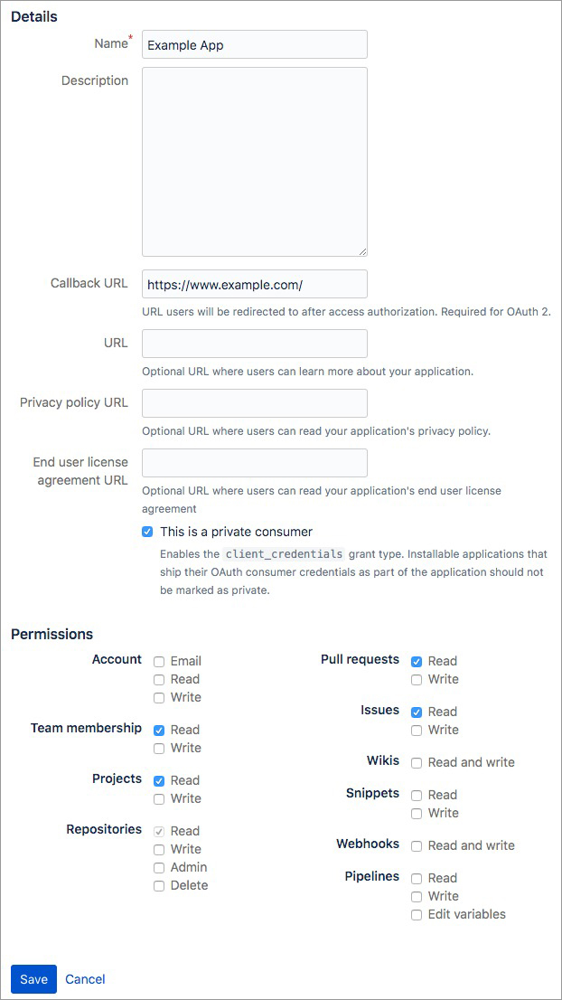

### About

This project contains my quick implementation to count total [issues](https://confluence.atlassian.com/bitbucket/issue-trackers-221449750.html) in my BitBucket team for further analysis.

### Motivation

We have many repositories under our BitBucket team and wanted to know which of them has issues.

### Usage

1. Create an app inside BitBucket (Settings > OAuth) with the following settings:

   

2. Copy and paste the app ID and secret into `config.yaml` file

3. Copy and paste team name into `config.yaml` file - for example, let say your Git remote is `git@bitbucket.org:bros/awesome-project.git`, the team name here is `bros`

4. Put all your team repositories inside the `repositories.txt` file - one repository per line

5. Run the script - `GO111MODULE=on go run *.go`

### Lessons Learned

- Adding `req.Header.Add("Accept-Encoding", "gzip, deflate")` is evil - it will make the response body turns into binary which at first looks like chunked data - removing it from the Go HTTP client code solves the problem
